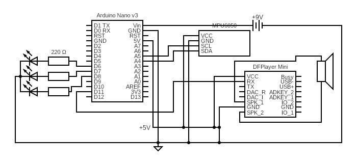

# WE LIKE TO PARTY!!
Simple gubbins I designed for the A-A5 Speeder for Star Wars Legion. Designed to flash an LED purple and play a sample of a song whenever the vehicle is picked up and moved.

## Diagram

## Components
- Arduino (I used a nano)
- 1 RGB LED
- 3 220 Ohm resistors for the RGB LED
- 1 2W 8 Ohm Speaker
- 1 DFPlayer Mini
- 1 MPU6050 IMU
- 1 SD Card with the the song to be played on the root of the card named"01.MP3"

## Dependencies
- Arduino-MPU6050 Library (https://github.com/jarzebski/Arduino-MPU6050, Click "Code" -> "Download ZIP", Import the zip as a library in Arduino Studio).
